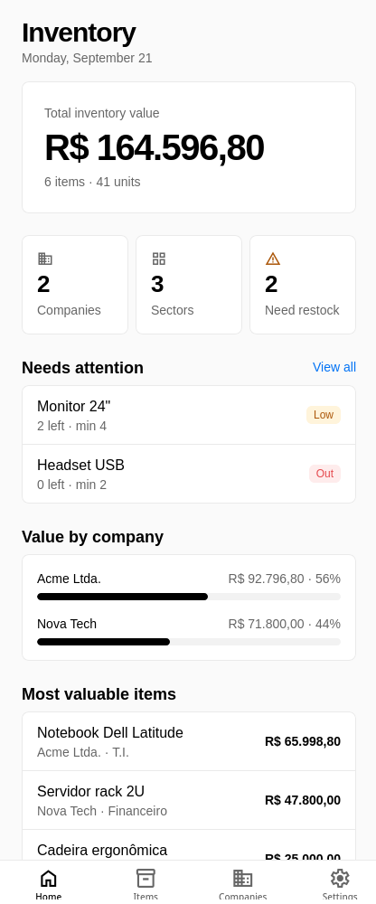
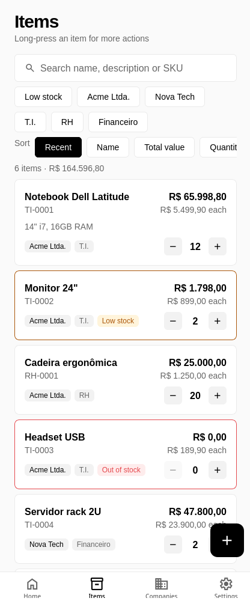
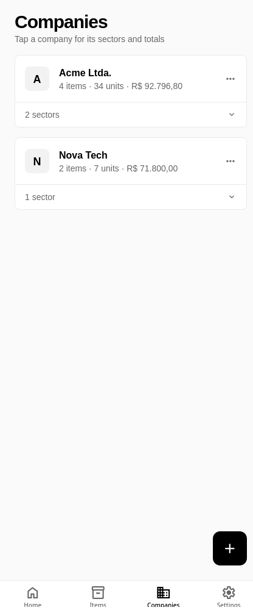
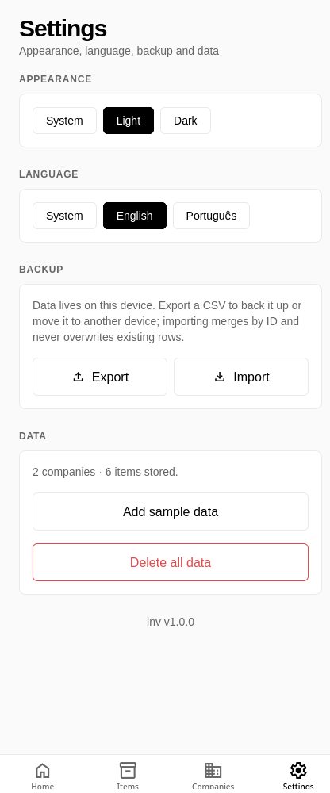
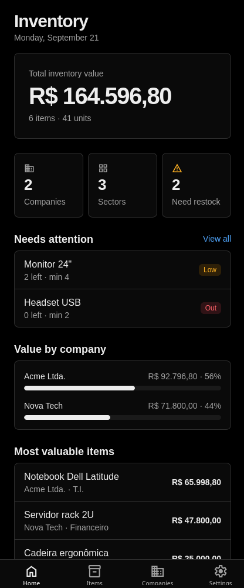
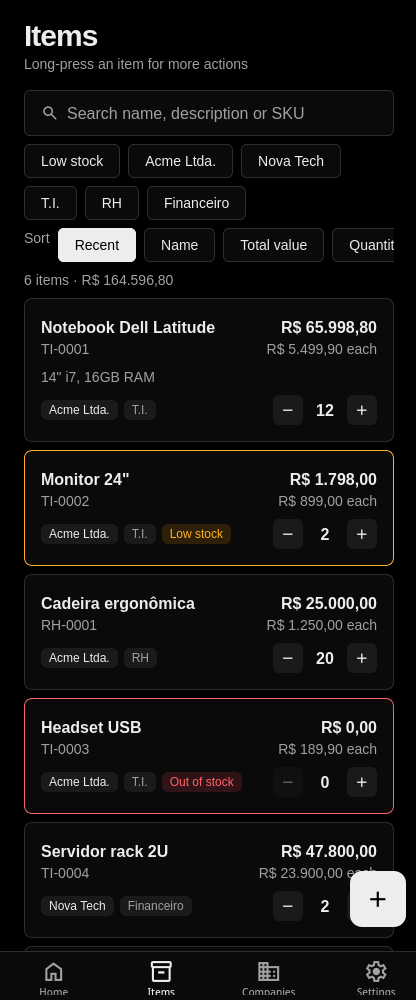
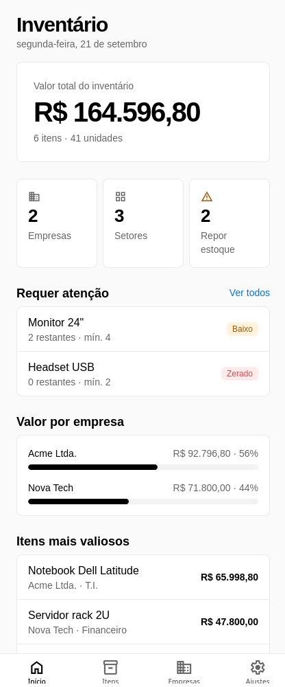
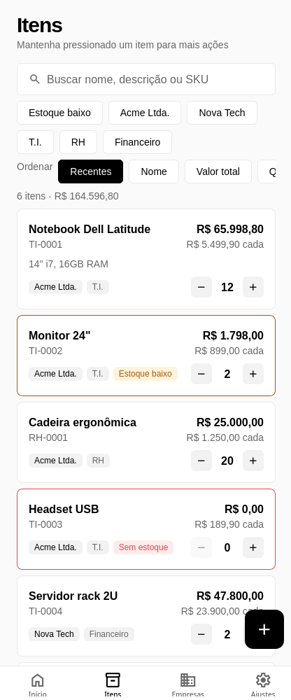

# inv — Inventory Management

A local-first inventory app for tracking items grouped by **company** and **sector**
(e.g. T.I., RH, Financeiro), with monetary values in Brazilian Reais (BRL).
Built with [Expo](https://expo.dev) (SDK 57) and [Expo Router](https://docs.expo.dev/router/introduction).

All data is stored on-device with `AsyncStorage`. There is no backend; data moves
between devices through CSV export/import.

<p align="center">
  
  
  
  
</p>
<p align="center">
  
  
  
  
</p>

## Features

**Dashboard**
- Total inventory value, item and unit counts at a glance.
- *Needs attention* list of items that are low on or out of stock.
- Value share per company, most valuable items and recently updated items.
- First-run welcome with one-tap sample data.

**Items**
- Name, description, SKU / asset tag, unit value (BRL), quantity, company and sector.
- **Low-stock threshold** per item, with *Low stock* / *Out of stock* badges and card highlights.
- **Quick stock adjustment** with +/- buttons right on the card (0 is allowed for out-of-stock items).
- Search by name, description or SKU (accent-insensitive: `informatica` finds *Informática*).
- Filter by company, sector or low stock; sort by recent, name, total value or quantity.
- Long-press for actions: edit, **duplicate**, delete. Items can also be deleted from the edit form.
- Live total (`value × quantity`) while editing.

**Companies & sectors**
- Nested organization; deleting a company or sector cascades to its sectors and items.
- Per-company and per-sector item counts, units and value.
- *View items* jumps to the Items tab pre-filtered by company or sector.

**Settings**
- Appearance: follow the system, or force light / dark (remembered across launches).
- Language: **English** and **Português (BR)**; follows the device language by default and can be overridden.
- CSV export / import (merge by ID, existing rows are kept).
- Load sample data, or delete all data.

## Design

The UI follows a Vercel / Geist-inspired look: a near-monochrome black-and-white
palette, hairline borders instead of shadows, tight radii, inverted primary buttons
and tightly tracked headings. Blue is used only for links; amber and red are reserved
for stock warnings and destructive actions. Both light and dark themes share the same
tokens in `src/constants/theme.ts`.

## Tech stack

| Area | Choice |
| --- | --- |
| Framework | Expo SDK 57, React Native 0.86, React 19 |
| Routing | expo-router (typed routes, file-based) |
| Storage | `@react-native-async-storage/async-storage` |
| Files | `expo-file-system`, `expo-sharing`, `expo-document-picker` |
| IDs | `expo-crypto` (`randomUUID`) |

## Project structure

```
src/
├── app/                     # expo-router routes
│   ├── _layout.tsx          # root stack + providers
│   ├── (tabs)/              # Home / Items / Companies / Settings tabs
│   └── modal/               # item, company and sector forms
├── components/              # UI primitives (button, chip, badge, action sheet) and cards
├── constants/theme.ts       # colors, spacing, fonts
├── hooks/
│   ├── useInventory.tsx     # inventory state provider + CRUD
│   ├── use-theme-preference.tsx # system / light / dark preference
│   └── use-theme.ts         # resolves the active color palette
├── i18n/
│   ├── translations.ts      # English and Portuguese dictionaries
│   └── index.tsx            # I18nProvider and useT() (interpolation, plurals)
├── services/
│   ├── storage.ts           # AsyncStorage CRUD
│   ├── stock.ts             # totals, low-stock rules, text normalization
│   ├── dialog.ts            # confirm / notify (works on native and web)
│   └── csv.ts               # CSV export/import + BRL formatting
└── types/index.ts           # Company, Sector, Item, InventoryData
```

## Data model

```ts
Company { id, name, createdAt }
Sector  { id, name, companyId, createdAt }
Item    { id, name, description?, sku?, value, quantity, minQuantity?, companyId, sectorId, createdAt, updatedAt }
```

`value` is the unit price stored as a plain number; totals are `value * quantity`.
An item is *low stock* when `0 < quantity <= minQuantity` and *out of stock* at `quantity = 0`.
Currency is formatted for display with `Intl.NumberFormat('pt-BR', …)`.

## CSV format

One file, one row per record, discriminated by the first column:

```
TYPE,ID,NAME,COMPANY_ID,SECTOR_ID,VALUE,QUANTITY,DESCRIPTION,CREATED_AT,UPDATED_AT,SKU,MIN_QUANTITY
COMPANY,<id>,<name>,,,,,,<iso>,,,
SECTOR,<id>,<name>,<companyId>,,,,,<iso>,,,
ITEM,<id>,<name>,<companyId>,<sectorId>,<value>,<qty>,<description>,<iso>,<iso>,<sku>,<min>
```

The `SKU` and `MIN_QUANTITY` columns are optional, so files exported by earlier
versions still import.

Import is a merge: records whose ID already exists are skipped, and imported
sectors/items that reference a missing company or sector are dropped.

## Get started

> **Note:** this app uses native modules and does **not** run in Expo Go. Use a
> development build.

1. Install dependencies

   ```bash
   npm install
   ```

2. Start the dev server

   ```bash
   npx expo start
   ```

3. Run on a device / emulator

   ```bash
   npm run android   # or: npm run ios
   ```

   Web is supported for quick UI work (`npm run web`), but file sharing and some
   native behavior differ from device. The screenshots above were captured from the web build.

## Scripts

| Command | Description |
| --- | --- |
| `npm start` | Start the Expo dev server |
| `npm run android` / `npm run ios` / `npm run web` | Start on a target platform |
| `npm run lint` | Run ESLint (`eslint-config-expo`) |

## Builds

EAS is configured in `eas.json` (`development`, `preview`, `production` profiles).
Android package: `com.ludihan.inv`.

```bash
eas build --profile preview --platform android
```
